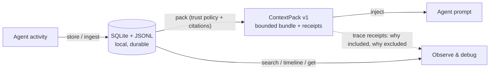

<div align="center">

# openclaw-mem

### The AI agent memory layer you can audit.

**Local-first memory governance for AI agents** — every context item cited,<br/>every exclusion explained, every mutation reversible.

[](https://pypi.org/project/openclaw-context-pack/)
[](https://github.com/phenomenoner/openclaw-mem/actions/workflows/ci.yml)
[](https://phenomenoner.github.io/openclaw-mem/)
[](#license)
[](docs/zh/index.md)

[**Website**](https://phenomenoner.github.io/openclaw-mem/) · [**30-second proof**](#see-it-in-30-seconds) · [**Quickstart**](QUICKSTART.md) · [**Upgrade to v2**](docs/upgrade-checklist.md) · [**v2.0.0**](docs/releases-v2.0.0.md) · [**Architecture**](docs/architecture.md) · [**FAQ**](#faq)

</div>

---

Most AI agent memory systems compete on **recall** — remember more, retrieve better. `openclaw-mem` competes on a different axis: **governance**. It captures agent activity as durable local records (SQLite + JSONL, no external database), then assembles bounded `ContextPack` bundles where every included memory carries a **citation**, every excluded memory carries a **written reason**, and every memory mutation ships with a **rollback receipt**.

Built sidecar-first for [OpenClaw](https://github.com/openclaw), usable with Claude, Codex, Gemini, and generic agent harnesses.

> **Not bigger memory — safer, explainable context.**

## Why agent memory needs governance, not just recall

Long-running agents don't just forget. Their memory **degrades silently**:

- **Stale notes** still match queries long after they stop being true.
- **Untrusted or hostile content** — tool output, scraped web text, injected instructions — retrieves well and slips into the prompt. This is the *memory poisoning* path of prompt injection, and similarity search alone cannot stop it.
- **Context bloat**: prompts swell into unbounded memory dumps nobody can review.
- **No accountability**: when the agent goes wrong, nothing explains *why* a memory was included.

Recall-focused memory layers make these failures *more* likely as they get better at retrieving. `openclaw-mem` adds the missing control layer: **trust policies decide what may enter context, receipts prove why, and rollback undoes what shouldn't have happened.**

## See it in 30 seconds

```bash
pip install openclaw-context-pack
openclaw-mem --db /tmp/openclaw-mem-demo.sqlite status --json
```

The PyPI distribution remains `openclaw-context-pack`; it installs the `openclaw-mem` CLI plus `openclaw-mem-mcp`, `openclaw-mem-channel-a`, and `openclaw-mem-hooks` for agent integration.

The default install needs no external vector database. Add only the local
capability you intend to use:

```bash
pip install "openclaw-context-pack[embed]"         # local FastEmbed embeddings
pip install "openclaw-context-pack[qdrant]"       # optional Qdrant Edge lane
pip install "openclaw-context-pack[embed,qdrant]" # both extras
```

Before upgrading an existing database, inspect it and preview the governed
migration. The write step creates a backup and can emit the rollback receipt:

```bash
openclaw-mem db info --db /path/to/openclaw-mem.sqlite --json
openclaw-mem db migrate --db /path/to/openclaw-mem.sqlite --dry-run --json
openclaw-mem db migrate --db /path/to/openclaw-mem.sqlite \
  --receipt-out migration-receipt.json --json
```

See the [database upgrade checklist](docs/upgrade-checklist.md) before applying
the migration to operator state.

Or run the reproducible trust-policy proof from the repo — no OpenClaw config, no real memory store, synthetic fixture only:

```bash
git clone https://github.com/phenomenoner/openclaw-mem.git
cd openclaw-mem
uv sync --locked
uv run --python 3.13 --frozen -- python benchmarks/trust_policy_synthetic_proof.py --json
```

The proof runs the **same query twice** against the same synthetic memory:

1. **Vanilla pack** — retrieval without a trust policy → a *quarantined* row gets selected, because its text matches the query.
2. **Trust-aware pack** (`--pack-trust-policy exclude_quarantined_fail_open`) → the quarantined row is **excluded, with an explicit receipt reason**, while citation coverage stays intact.

The assertion block it must pass:

```json
{
  "synthetic_fixture_only": true,
  "no_real_memory_paths_used": true,
  "quarantined_removed": true,
  "citation_coverage_preserved": true,
  "trust_policy_explains_exclusion": true
}
```

That is the product in one JSON object: **same memory, same query — but governed context, with evidence.** Details: [trust-policy synthetic proof](docs/showcase/trust-policy-synthetic-proof.md).

## How it works: Store → Pack → Observe



1. **Store** — capture, ingest, and query observations with `store` / `ingest` / `search`. Records keep backend/action annotations and provenance.
2. **Pack** — `pack` emits a bounded `bundle_text` + `context_pack` (`schema: openclaw-mem.context-pack.v1`) with citations, trust-policy decisions, and trace receipts.
3. **Observe** — `timeline`, `get`, and artifact outputs explain what happened, support debugging, and back rollback.

When the optional mem-engine is active, **Proactive Pack** extends the same contract into live turns as a small, receipt-backed pre-reply bundle.

## Core features

| Capability | What you get |
| --- | --- |
| 🛡️ **Trust-aware packing** | Quarantined/untrusted records are excluded by policy, with written reasons in the receipt — a defense-in-depth layer against memory poisoning |
| 🔗 **Citations everywhere** | Every packed item traces back to its source record; citation coverage is measured |
| 🧾 **Trace receipts** | Include/exclude decisions are structured JSON, not vibes — auditable after the fact |
| ⏪ **Rollback** | Memory and skill mutations go through plan → checkpoint → apply → receipt → rollback |
| 🔍 **Hybrid recall** | SQLite FTS + vector search, with scopes and auditable policies |
| 🕰️ **Temporal facts** | "What is currently true about X" — source-linked assertions, timelines, conflict/staleness lint |
| 🕸️ **Graph query plane** | `graph query` for upstream/downstream/lineage over a SQLite-derived graph |
| 🔌 **Contract-first harness integration** | MCP hash manifests, Channel A file packs, harness-home env bridge, and shadow-only service/Qdrant probes for safe cutover checks |
| 💻 **Local-first** | JSONL + SQLite. No cloud service, no external vector DB required, data stays on your machine |

Advanced opt-in labs (graph routing, GBrain sidecar, governed continuity, Dream Lite, Self Curator engine) stay out of the first evaluation path: [Core vs Advanced Labs](docs/core-vs-advanced-labs.md).

## How it compares

Honest framing: if you want maximum recall benchmarks, the projects below are excellent — and `openclaw-mem` is *not* trying to beat them at that game. It governs what enters your context window.

| | Recall-focused memory layers<br/>(mem0, supermemory, mempalace, claude-mem, memory-lancedb-pro…) | `openclaw-mem` |
| --- | --- | --- |
| Primary question | "Did the agent remember the right thing?" | "Should this memory be trusted — and can you prove why it's in the prompt?" |
| Inclusion logic | Similarity / relevance scores (opaque) | Explicit receipts with include & exclude reasons |
| Untrusted content | Retrieves whenever it matches | Quarantined by trust policy; exclusion documented |
| Mistake recovery | Delete and hope | Checkpointed mutations with rollback receipts |
| Storage default | Vector DB, often cloud | SQLite + JSONL, local-first |
| Best at | Recall quality, token savings | Auditability, safety, explainability |

They are **complementary**: openclaw-mem already pushes bounded metadata to LanceDB via its writeback loop, and the long-term direction is governance-as-a-layer over whatever recall engine you prefer.

## Quickstart paths

| Time | Path | Where |
| --- | --- | --- |
| ⚡ 5 min | pip CLI + synthetic proof | [Evaluator path](docs/evaluator-path.md) |
| ☕ 30 min | Sidecar install, real capture, first governed pack | [Install modes](docs/install-modes.md) |
| 🌆 Afternoon | OpenClaw plugin / mem-engine promotion, MCP/Channel A/hooks integration for Codex/Claude/Gemini | [MCP integration](docs/mcp-integration.md), [Channel A](docs/channel-a-file-contract.md), [Lifecycle hooks](docs/lifecycle-hooks.md) |

<details>
<summary><b>Harness operators: verify integration without promoting a new memory owner</b></summary>

```bash
openclaw-mem --harness-home /path/to/.agent-harness status --json
openclaw-mem --harness-home /path/to/.agent-harness service-store init --json
openclaw-mem --harness-home /path/to/.agent-harness writeback-store init --json
openclaw-mem --json graph topology-extract --harness-home /path/to/.agent-harness --workspace /path/to/.agent-harness/workspace
openclaw-mem service status --json
openclaw-mem qdrant status --json
openclaw-mem qdrant recall --db /path/to/.agent-harness/memory/openclaw-mem.sqlite --vector "[0.1]" --json
openclaw-mem-mcp --tool-descriptions --json
```

The status, topology, service, and Qdrant probes are contract-first v0 surfaces. Store `init` commands only create empty readiness JSONL files under the harness-managed memory/state trees; they do not promote active prompt ownership or write memory content. Qdrant vector recall remains optional/fail-closed and falls back to the SQLite/search lane when the shard or dependency is unavailable.

</details>

## FAQ

<details>
<summary><b>What is memory governance for AI agents?</b></summary>

Memory governance means treating an agent's memory like a supply chain with controls: provenance for every record, trust tiers for every source, explicit policy decisions about what may enter the context window, receipts documenting those decisions, and rollback when something was wrong. Recall answers *"what matches?"*; governance answers *"what is allowed in, and why?"*

</details>

<details>
<summary><b>How is openclaw-mem different from mem0, claude-mem, or mempalace?</b></summary>

Those projects optimize recall quality and token efficiency — and do it well. openclaw-mem optimizes **auditability**: citations, trust policies, trace receipts, and rollback are the core contract, not add-ons. See [How it compares](#how-it-compares). You can use them together.

</details>

<details>
<summary><b>Does it protect against memory poisoning / prompt injection via memory?</b></summary>

It is a defense-in-depth layer, not a silver bullet. Content from tools, web pages, and skills starts untrusted; trust policies keep quarantined records out of packs even when they match the query, and the receipt documents the exclusion. The [synthetic proof](docs/showcase/trust-policy-synthetic-proof.md) demonstrates exactly this behavior, reproducibly.

</details>

<details>
<summary><b>Do I need a vector database or a cloud service?</b></summary>

No. The default stack is SQLite + JSONL on your own machine. Hybrid recall (FTS + vector) works locally. There is no hosted service and no telemetry.

</details>

<details>
<summary><b>Can I use it outside OpenClaw — with Claude, Codex, or Gemini?</b></summary>

Yes. `openclaw-mem harness install` writes a managed persistent-memory instruction card for Codex, Claude, Gemini, or a generic agent surface. OpenClaw is the first-class host, not a requirement.

</details>

<details>
<summary><b>What is a ContextPack?</b></summary>

A bounded, injectable bundle (`openclaw-mem.context-pack.v1`) containing the selected memory text plus structured metadata: citations for every item, trust-policy decisions, and a trace receipt explaining the selection. It is designed to be small, inspectable, and stable as a contract.

</details>

<details>
<summary><b>Is the retrieval quality competitive?</b></summary>

Retrieval is hybrid (FTS + vector) with scopes and policy-aware ranking — solid, but openclaw-mem does not currently publish comparative recall benchmarks, and the [reality check](docs/reality-check.md) is candid about what is and isn't measured. The differentiated value is governance; broader public benchmarks are on the roadmap.

</details>

<details>
<summary><b>How do I undo a bad memory change?</b></summary>

Mutations flow through explicit plans, checkpoints, diffs, and receipts. `self-curator rollback --receipt <apply-receipt.json>` restores the previous state from the receipt. The same posture applies to engine adoption: promotion is a one-line slot switch, and so is retreat.

</details>

<details>
<summary><b>Is this production ready?</b></summary>

It is a young, actively developed project (v2.0.0, single maintainer). Core Store/Pack/Observe and the trust-policy path are shipped and tested; advanced lanes are explicitly labeled labs. Start with the [reality check](docs/reality-check.md) — it tells you what is automatic, what is partial, and what is opt-in.

</details>

## OpenClaw native memory and openclaw-mem

OpenClaw's native memory got noticeably stronger by 2026.4.15 — good for the ecosystem, and good for this project. openclaw-mem doesn't duplicate native recall; it builds an opinionated **governance layer** on top of a stronger foundation: better packs, clearer evidence, safer memory maintenance. More: [why openclaw-mem still exists](docs/why-openclaw-mem-still-exists.md) · [2026.4.15 comparison](docs/openclaw-2026-4-15-comparison.md).

## Documentation

- **Docs site:** <https://phenomenoner.github.io/openclaw-mem/>
- [Quickstart](QUICKSTART.md) · [Architecture](docs/architecture.md) · [Context pack](docs/context-pack.md) · [Install modes](docs/install-modes.md)
- [MCP integration](docs/mcp-integration.md) · [Channel A file contract](docs/channel-a-file-contract.md) · [Lifecycle hooks](docs/lifecycle-hooks.md)
- [Evaluator path](docs/evaluator-path.md) · [Core vs Advanced Labs](docs/core-vs-advanced-labs.md) · [Reality check](docs/reality-check.md)
- [Temporal facts](docs/temporal-facts.md) · [Optional Mem Engine](docs/mem-engine.md) · [Self Curator (review-gated)](docs/specs/self-curator-sidecar-v0.md)
- [Agent memory SOP](docs/agent-memory-skill.md) · [Deployment patterns](docs/deployment.md) · [Product positioning](PRODUCT_POSITIONING.md)
- **繁體中文文件:** [docs/zh/index.md](docs/zh/index.md)
- [Release notes](https://github.com/phenomenoner/openclaw-mem/releases) · [Changelog](CHANGELOG.md)

## Project status

Actively developed by a single maintainer; issues and reproducible bug reports are welcome. The roadmap favors small, receipt-backed, rollbackable releases over big-bang features — see [docs/roadmap.md](docs/roadmap.md).

## License

Dual-licensed under **MIT OR Apache-2.0** — see [`LICENSE`](LICENSE) (MIT) and [`LICENSE-APACHE`](LICENSE-APACHE).
