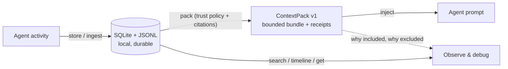

<div class="ocm-hero" markdown="1">

<div class="ocm-eyebrow">Local-first memory governance for AI agents</div>

# Memory your agent can't lie about.

<p class="ocm-sub">
<code>openclaw-mem</code> captures agent activity into a <strong>local ledger you can grep, diff, and roll back</strong> — then packs bounded, cited context back into the prompt. Every included memory carries a <strong>citation</strong>. Every excluded memory carries a <strong>written reason</strong>. Every mutation ships with a <strong>rollback receipt</strong>.
</p>

<div class="ocm-pills" markdown="1">
<span>SQLite + JSONL · no cloud</span>
<span>Sidecar-first</span>
<span>Trust-aware packing</span>
<span>OpenClaw · Claude · Codex · Gemini</span>
</div>

<div class="ocm-terminal" markdown="1">
```json
{
  "synthetic_fixture_only": true,
  "quarantined_removed": true,
  "citation_coverage_preserved": true,
  "trust_policy_explains_exclusion": true
}
```
</div>

<div class="ocm-ctas" markdown="1">
[Run the 30-second proof](showcase/trust-policy-synthetic-proof.md){ .md-button .md-button--primary }
[Quickstart](quickstart.md){ .md-button }
[Choose an install path](install-modes.md){ .md-button }
</div>

<div class="ocm-stats" markdown="1">
<div class="ocm-stat" markdown="1"><b>Every inclusion → cited</b><span>each packed item traces back to its source record</span></div>
<div class="ocm-stat" markdown="1"><b>Every exclusion → explained</b><span>trust policy decisions land in written receipts</span></div>
<div class="ocm-stat" markdown="1"><b>Every mutation → reversible</b><span>plan → checkpoint → apply → receipt → rollback</span></div>
</div>

</div>

<div class="ocm-kicker">How it works</div>

## Store → Pack → Observe

<div class="ocm-grid" markdown="1">

<div class="ocm-card" markdown="1">
<span class="ocm-ico">🗄️</span><span class="ocm-step">1</span>
### Store the trail
Capture observations into append-only JSONL, ingest them into SQLite with FTS, and keep durable receipts for tool outcomes, decisions, preferences, and ops breadcrumbs.
</div>

<div class="ocm-card" markdown="1">
<span class="ocm-ico">📦</span><span class="ocm-step">2</span>
### Pack with receipts
Build bounded `ContextPack` bundles — cited memories under a token budget, filtered by trust policy, with a trace receipt explaining every include and exclude.
</div>

<div class="ocm-card" markdown="1">
<span class="ocm-ico">🔍</span><span class="ocm-step">3</span>
### Observe everything
Search, timelines, exact records, pack traces, and rollback-friendly artifacts. When the agent goes wrong, the evidence is already on disk.
</div>

</div>



<div class="ocm-kicker">Why governance</div>

## Recall is not the hard part. Trust is.

Long-running agents don't just forget — their memory **degrades silently**. Stale notes keep matching queries. Injected or hostile content retrieves well and slips into the prompt. Context swells into unbounded memory dumps nobody can review.

Recall-focused memory layers make these failures *more* likely as retrieval gets better. `openclaw-mem` adds the missing control layer: **trust policies decide what may enter context, receipts prove why, and rollback undoes what shouldn't have happened.**

The reproducible proof runs the **same query twice** against the same synthetic memory:

1. **Vanilla pack** — a *quarantined* row gets selected, because its text matches the query.
2. **Trust-aware pack** — the quarantined row is **excluded with an explicit receipt reason**, while citation coverage stays intact.

[See the full proof, fixture, and assertions →](showcase/trust-policy-synthetic-proof.md)

<div class="ocm-kicker">Install</div>

## Two commands to a governed memory

=== "pip"

    ```bash
    pip install openclaw-context-pack
    openclaw-mem --db /tmp/openclaw-mem-demo.sqlite status --json
    ```

=== "uv (from source)"

    ```bash
    git clone https://github.com/phenomenoner/openclaw-mem.git
    cd openclaw-mem && uv sync --locked
    uv run --python 3.13 --frozen -- python -m openclaw_mem --help
    ```

=== "Then try the loop"

    ```bash
    openclaw-mem search "timezone privacy demo style" --json
    openclaw-mem timeline --limit 5 --json
    openclaw-mem pack "write the demo plan" --json
    ```

The PyPI distribution is `openclaw-context-pack`; it installs the `openclaw-mem` CLI plus `openclaw-mem-mcp`, `openclaw-mem-channel-a`, and `openclaw-mem-hooks` for agent integration. No vector DB required, no hosted service, no telemetry.

<div class="ocm-kicker">Positioning</div>

## How it compares

Honest framing: if you want maximum recall benchmarks, projects like mem0, supermemory, and mempalace are excellent — and `openclaw-mem` is *not* trying to beat them at that game. It governs what enters your context window.

| | Recall-focused memory layers | `openclaw-mem` |
| --- | --- | --- |
| Primary question | "Did the agent remember the right thing?" | "Should this memory be trusted — and can you prove why it's in the prompt?" |
| Inclusion logic | Similarity / relevance scores (opaque) | Explicit receipts with include & exclude reasons |
| Untrusted content | Retrieves whenever it matches | Quarantined by trust policy; exclusion documented |
| Mistake recovery | Delete and hope | Checkpointed mutations with rollback receipts |
| Storage default | Vector DB, often cloud | SQLite + JSONL, local-first |
| Best at | Recall quality, token savings | Auditability, safety, explainability |

They are **complementary**: openclaw-mem already pushes bounded metadata to LanceDB via its writeback loop, and the long-term direction is governance-as-a-layer over whatever recall engine you prefer.

<div class="ocm-kicker">See it running</div>

## Proof, not promises

<div class="ocm-grid" markdown="1">

<div class="ocm-card" markdown="1">
<span class="ocm-ico">🧪</span>
### Trust-policy synthetic proof
Synthetic, privacy-safe, reproducible: vanilla packing vs trust-aware packing on the same memory.

[Run the proof →](showcase/trust-policy-synthetic-proof.md)
</div>

<div class="ocm-card" markdown="1">
<span class="ocm-ico">🎬</span>
### 5-minute Inside-Out demo
How stable preferences and constraints become a cited context pack.

[Open the demo →](showcase/inside-out-demo.md)
</div>

<div class="ocm-card" markdown="1">
<span class="ocm-ico">🗺️</span>
### Topology-aware recall
Answer "where is this implemented?" from docs and topology surfaces without polluting durable memory.

[See topology demo →](showcase/topology-demo.md)
</div>

<div class="ocm-card" markdown="1">
<span class="ocm-ico">📋</span>
### Reality check
What is shipped, partial, experimental, and roadmap — no fake maturity theater.

[Check current status →](reality-check.md)
</div>

</div>

Go deeper: [LongMemEval_s retrieval slice](showcase/longmemeval-s-retrieval-slice.md) · [trust-aware pack proof](showcase/trust-aware-context-pack-proof.md) · [proof artifacts](showcase/artifacts/index.md) · [Proactive Pack](proactive-pack.md) · [portable pack capsules](portable-pack-capsules.md) · [temporal facts](temporal-facts.md)

<div class="ocm-kicker">Adopt at your pace</div>

## Sidecar first. Promotion only when it earns the seat.

<div class="ocm-grid" markdown="1">

<div class="ocm-card" markdown="1">
<span class="ocm-step">1</span>
### Run the proof
Prove the trust-aware pack contract on synthetic data — no config, no real memory.
</div>

<div class="ocm-card" markdown="1">
<span class="ocm-step">2</span>
### Install the sidecar
Capture and harvest observations **beside** your current OpenClaw memory slot.
</div>

<div class="ocm-card" markdown="1">
<span class="ocm-step">3</span>
### Use local recall first
`search → timeline → get → pack` before reaching for heavier systems.
</div>

<div class="ocm-card" markdown="1">
<span class="ocm-step">4</span>
### Promote carefully
Enable the optional mem-engine only when hybrid recall and policy controls justify it. Rollback stays one line.
</div>

</div>

Route by time budget: **5 minutes** → [evaluator path](evaluator-path.md) · **30 minutes** → [install modes](install-modes.md) · **an afternoon** → [MCP integration](mcp-integration.md), [architecture](architecture.md), [context pack contract](context-pack.md)

??? note "Words we mean precisely"

    - **Sidecar** — a local companion layer that captures and searches memory records without owning OpenClaw's active memory backend.
    - **Memory slot** — the backend OpenClaw asks when it needs memory. The sidecar does not need to replace it.
    - **Ingest / harvest** — scheduled import from captured JSONL into searchable SQLite.
    - **Receipt** — a small record that says what happened, where it came from, and how to cite it.
    - **ContextPack** — a compact, cited bundle of relevant memories prepared for the agent (`openclaw-mem.context-pack.v1`).

!!! tip "When *not* to use it"

    One short chat, no ops trail, no audit need, no repeated context? The model context window is probably enough. `openclaw-mem` is for the moment memory becomes **operational infrastructure**.

<div class="ocm-banner" markdown="1">

## Start with the proof. Keep the receipts.

Local-first, inspectable, reversible — evaluate it in five minutes with synthetic data, then let it earn its way into your agent stack. 繁體中文讀者：[中文版文件](zh/index.md)。

<div class="ocm-ctas" markdown="1">
[Run the 30-second proof](showcase/trust-policy-synthetic-proof.md){ .md-button .md-button--primary }
[GitHub](https://github.com/phenomenoner/openclaw-mem){ .md-button }
[Releases](https://github.com/phenomenoner/openclaw-mem/releases){ .md-button }
</div>

</div>
