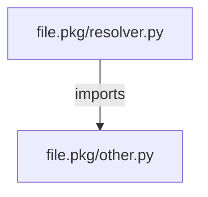

<!-- GENERATED by openclaw-mem graph render topology. Review-only derived artifact; not source of truth. -->

```mermaid
graph TD
%% nodes: 2 edges: 1
  n_file_pkg_other_py["file.pkg/other.py"]
  n_file_pkg_resolver_py["file.pkg/resolver.py"]
  n_file_pkg_resolver_py -->|"imports"| n_file_pkg_other_py
```
